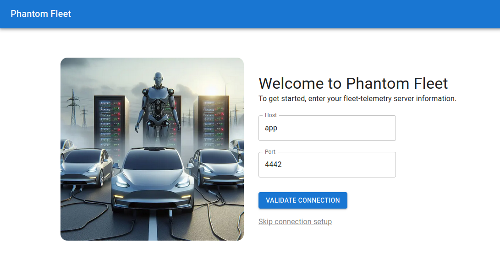

# Phantom Fleet Client

This web client allows sending data to a fleet-telemetry server. It is in its early stages and only has minimal functionality at this time.

More documentation to come.

## Configuration

**Environment Variables**:

- `NEXT_PUBLIC_PHANTOM_FLEET_API_URL`: the URL the phantom-fleet API is exposed on
